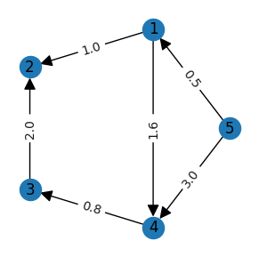
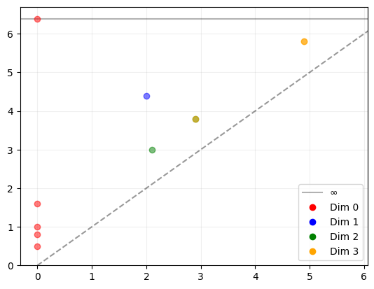

# Tutorial
*Tutorials are lessons that take the reader by the hand through a series of steps to complete a project of some kind. Tutorials are learning-oriented.*

The code in this project is used to analyze the general structure of a directed graph. Here we show a simple example that uses this tool.

### A weighted directed graph

First, we need a graph to analyze. For this example we will use the following graph given by its adjacency matrix. Note that the weights of edges are included in this matrix.

```
>>> import numpy as np
>>> adjacency_matrix = np.array([[0. , 1. , 0. , 1.6, 0. ],
                                [0. , 0. , 0. , 0. , 0. ],
                                [0. , 2. , 0. , 0. , 0. ],
                                [0. , 0. , 0.8, 0. , 0. ],
                                [0.5, 0. , 0. , 3. , 0. ]])
>>> graph = nx.DiGraph(adjacency_matrix)
```


### Compute persistent homology

Now we just use our function to compute persistent homology on this graph as shown below. We may choose a higher homology dimension. The output of this function is a list of persistence diagrams (one per dimension from 0 to `max_dim` plus possibly a last one showing evidence of higher dimensional points) as `dionysus.Diagram` objects.
```
>>> dgms = newfiltration_persistence(graph, max_dim = 3)
>>> dgms
[Diagram with 5 points,
 Diagram with 1 points,
 Diagram with 2 points,
 Diagram with 3 points,
 Diagram with 1 points]
```

### Plot persistence diagram

We may also use the plotting function to see the persistence diagram.
```
>>> plot_dgms(dgms, max_dim=3)
```
